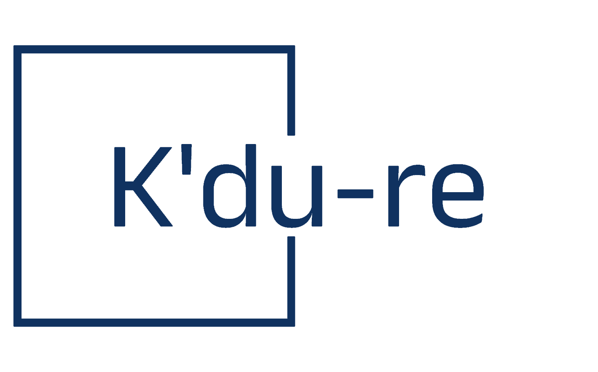
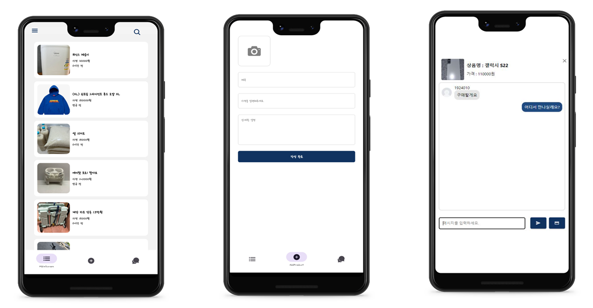

# 서버 리팩토링 작업중 : server -> server1
  - 사용자 (user) mvc 구조 작업 60% 완료 (#todo ~0717)
  - 상품, 검색 (product, search) mvc 구조 작업 30% 완료 (#todo ~0720)
  - 채팅, 메세지 ( chat, message) mvc 구조작업 20% 완료 (#todo ~0731)
  - #todo 결제 (payment) mvc 구조작업 진행 예정 (~0731)
  - #todo 학생증 인증 (Google Vision ocr) mvc 구조작업 진행 예정 (~0731)
    
# K' Du-re - 대학생들을 위한 중고거래 플랫폼

K' Du-re는 대학생들을 위한 중고거래 플랫폼으로, 
React.js 및 React-Native를 활용한 프론트엔드와 Node.js를 활용한 백엔드로 구성되어 있습니다. 
MySQL 및 AWS RDS를 사용하여 데이터베이스를 구축하였으며, AWS EC2와 Nginx를 활용하여 서버를 호스팅하고 
HTTPS 프로토콜을 지원합니다.

## 기술 스택
- **프론트엔드**: React.js, React-Native
- **백엔드**: Node.js, express.js
- **데이터베이스**: MySQL, AWS RDS
- **서버**: AWS EC2, Nginx
- **통신**: 웹소켓 (wss)

## 활용 API
- **Google Cloud Vision API**: 이미지 분석 및 인식
- **Toss Payments API / SDK**: 결제 처리
- **Naver/Kakao 소셜 로그인 API**: 소셜 로그인 기능

## 개발 성과
- **클라우드 서버 구축**: AWS EC2 서버 설정 및 운영
- **데이터베이스 호스팅**: AWS RDS를 이용한 MySQL 데이터베이스 호스팅 및 구축
- **API 서버 연동**: Vision API와 Payments API 서버 연동
- **HTTPS 구축**: Nginx 및 Certbot을 활용한 SSL/TLS 인증서 발급 및 HTTPS 프로토콜 지원
- **프론트엔드 개발**: React.js를 활용한 프론트엔드 레이아웃 구성 (당근마켓 클론 코딩)
- **백엔드 환경 구축**: express.js를 이용한 백엔드 서버 환경 구축
- **프로젝트 배포**: 도메인 발급 및 빌드된 리액트 프로젝트 배포 및 관리
- **채팅 기능 구현**: 웹소켓(wss)을 활용한 보안 강화 양방향 웹소켓 통신 환경을 통한 채팅 기능 구현
- **테이블 구성**: RDBMS(MySQL)의 전반적인 테이블 구성 및 관리
## 구현화면 (웹url)
https://ec2caps.liroocapstone.shop/
## 구현화면 (앱)

